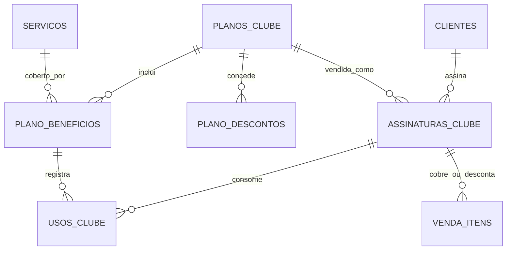

# Nextgest — Modelo de Dados: Clube de Assinatura

> Documento vivo. Liga-se a [[Modelo de Dados - Núcleo de Agendamento]] e
> [[Modelo de Dados - Produtos e Vendas]]. Decisões em [[Decisões de Arquitetura]]
> (D15 a D17).

---

## 1. Decisões deste bloco

- **Benefício configurável por plano:** cada benefício é **ilimitado** ou tem
  **cota** (X usos por período).
- **Restrição por benefício:** pode limitar dias da semana e faixa de horário
  (ex.: "corte de seg a sáb, até 18h").
- **Descontos/cupons:** além dos serviços inclusos, o plano pode conceder
  desconto em produtos e serviços extras.

---

## 2. Conceitos novos (glossário rápido)

- **Plano do clube:** o pacote que o estabelecimento vende ao cliente (nome,
  preço mensal, o que inclui).
- **Benefício:** o que o plano dá. Ex.: "corte ilimitado" ou "4 cortes/mês".
- **Cota:** o limite de usos de um benefício num período. Quando é ilimitado,
  não há cota.
- **Assinatura:** o vínculo ativo de um cliente com um plano (quando começou,
  status, próxima cobrança).
- **Uso:** o registro de cada consumo de um benefício — é o que desconta da cota
  e alimenta os relatórios.
- **Ciclo:** o período em que a cota vale (ver ponto em aberto sobre mês
  calendário vs data de adesão).

---

## 3. Entidades (tabelas)

### 3.1 `planos_clube` — os planos vendidos pelo estabelecimento

| Campo | Tipo | Para que serve |
|---|---|---|
| id | bigint PK | — |
| nome | string | Ex.: "Corte Seg–Sáb" |
| descricao | text null | Detalhes/benefícios em texto |
| preco_mensal | decimal(10,2) | Mensalidade |
| periodicidade | string/enum | mensal (espaço para anual no futuro) |
| ativo | boolean | Se está à venda |
| timestamps | datetime | — |

### 3.2 `plano_beneficios` — o que o plano inclui

| Campo | Tipo | Para que serve |
|---|---|---|
| id | bigint PK | — |
| plano_id | FK → planos_clube | A qual plano pertence |
| servico_id | FK → servicos | Serviço incluído |
| tipo | string/enum | ilimitado, cota |
| cota_quantidade | integer null | Quantos usos por ciclo (se tipo = cota) |
| dias_semana_permitidos | json/string null | Ex.: [1,2,3,4,5,6] = seg a sáb |
| hora_inicio | time null | Início da janela permitida |
| hora_fim | time null | Fim da janela permitida |
| timestamps | datetime | — |

Restrições nulas significam "sem restrição".

### 3.3 `plano_descontos` — descontos/cupons concedidos pelo plano

| Campo | Tipo | Para que serve |
|---|---|---|
| id | bigint PK | — |
| plano_id | FK → planos_clube | A qual plano pertence |
| aplica_em | string/enum | servico, produto, categoria, todos |
| servico_id | FK → servicos null | Se for desconto num serviço específico |
| produto_id | FK → produtos null | Se for desconto num produto específico |
| categoria_id | FK → categorias_produto null | Se for desconto numa categoria |
| tipo_desconto | string/enum | percentual, valor |
| valor | decimal(10,2) | A % ou o valor do desconto |
| timestamps | datetime | — |

### 3.4 `assinaturas_clube` — a assinatura do cliente

| Campo | Tipo | Para que serve |
|---|---|---|
| id | bigint PK | — |
| cliente_id | FK → clientes | Quem assinou |
| plano_id | FK → planos_clube | Qual plano |
| status | string/enum | ativa, suspensa, cancelada, inadimplente |
| preco_contratado | decimal(10,2) | **Snapshot** do preço na adesão |
| data_inicio | date | Início |
| data_fim | date null | Fim (se cancelada) |
| proxima_cobranca | date null | Próxima cobrança (liga ao gateway) |
| gateway_id | FK → gateways_pagamento null | Por onde a mensalidade é cobrada |
| gateway_assinatura_id | string null | Id da recorrência no gateway |
| timestamps | datetime | — |

### 3.5 `usos_clube` — consumo dos benefícios

| Campo | Tipo | Para que serve |
|---|---|---|
| id | bigint PK | — |
| assinatura_id | FK → assinaturas_clube | De qual assinatura |
| plano_beneficio_id | FK → plano_beneficios | Qual benefício foi usado |
| servico_id | FK → servicos | Serviço consumido |
| agendamento_id | FK → agendamentos null | Em qual agendamento |
| venda_item_id | FK → venda_itens null | Item da venda correspondente |
| periodo_referencia | string | Ciclo, ex.: "2026-06" |
| data | datetime | Quando |
| timestamps | datetime | — |

---

## 4. Relacionamentos (resumo)

- `planos_clube` 1 : N `plano_beneficios`.
- `planos_clube` 1 : N `plano_descontos`.
- `planos_clube` 1 : N `assinaturas_clube`.
- `clientes` 1 : N `assinaturas_clube`.
- `assinaturas_clube` 1 : N `usos_clube`.
- `servicos` 1 : N `plano_beneficios` e 1 : N `usos_clube`.
- `assinaturas_clube` ligação com `venda_itens` (item coberto/descontado).

---

## 5. Diagrama (Mermaid)

---

## 6. Lógica importante (regras, não colunas)

- **Validar benefício ao agendar/fechar venda:** verifica se o serviço está num
  benefício do plano, se há cota disponível no ciclo (conta `usos_clube` do
  período) e se respeita a restrição de dia/horário.
- **Item coberto na venda:** se o benefício for ilimitado ou houver cota, o
  `venda_item` entra com `coberto_por_assinatura = true` e `preco_unitario = 0`,
  ligado por `assinatura_id`. Registra-se um `uso_clube`.
- **Item com desconto:** se não for coberto mas houver `plano_desconto` aplicável,
  o `preco_unitario` do item já entra com o desconto e guarda `assinatura_id`.
- **Cobrança recorrente:** a mensalidade da assinatura será cobrada via gateway
  (próximo bloco). `proxima_cobranca` é o gancho.

---

## 7. Pontos em aberto

1. **Confirmado:** o ciclo da cota conta a partir da **data de adesão** da
   assinatura (ex.: assinou dia 20 → cota reinicia todo dia 20).
2. **(A confirmar)** Troca/upgrade de plano: como tratar (cancela e cria nova
   assinatura, ou altera a existente).
3. **Pagamento** da mensalidade: detalhado no próximo bloco (gateway recorrente).

---

## 8. Impacto no bloco de Produtos e Vendas

A tabela `venda_itens` ganha duas colunas para suportar o clube:
- `coberto_por_assinatura` (boolean) — item incluído no plano (preço 0).
- `assinatura_id` (FK → assinaturas_clube null) — qual assinatura cobriu/descontou.

(Atualização registrada no documento de Produtos e Vendas.)

---

## 9. Próximos blocos

1. Pagamentos (gateway plugável, tokenização, cobrança recorrente do clube).
2. Kanban.
3. Automações de WhatsApp.
