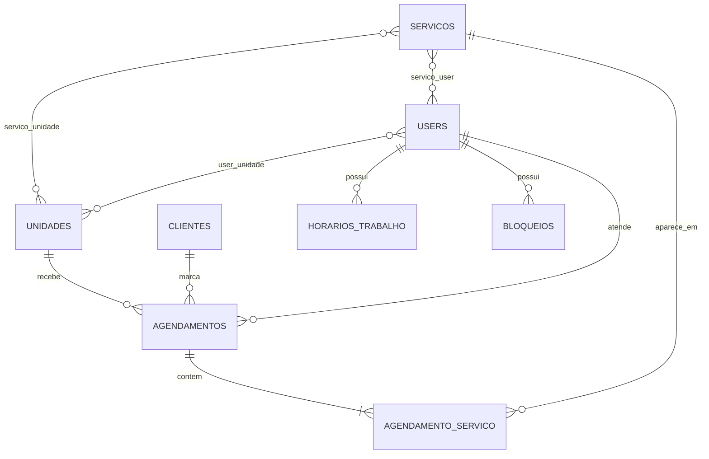

# Nextgest — Modelo de Dados: Núcleo de Agendamento

> Documento vivo. Marcações **(A confirmar)** indicam pontos ainda em aberto.
> Cobre apenas o núcleo de agendamento. Ver [[Nextgest - Visão Geral]] e
> [[Decisões de Arquitetura]].

---

## 1. Visão geral e decisões já travadas

- **Multi-tenancy:** banco por tenant, usando o pacote `stancl/tenancy`.
- **Banco central:** guarda `tenants`, `domains`, planos do SaaS (depois) e o
  super-admin (você). *Não faz parte deste documento.*
- **Banco do tenant:** guarda tudo o que está aqui. Cada estabelecimento tem o seu.
- **Identificação:** por caminho (path-based) — `nextgest.com.br/{slug}`.
- **Multi-unidade:** um tenant pode ter várias unidades (filiais). Quando só há
  uma, ela fica "escondida" na interface.
- **Logins separados (guards):**
  - `users` → equipe interna (Dono, Gerente, Recepção, Profissional), com papéis
    do `spatie/laravel-permission`.
  - `clientes` → clientes finais, login próprio no portal de agendamento.
- **Agendamento com múltiplos serviços:** um agendamento pode juntar vários
  serviços (ex.: corte + barba). Duração e preço totais são a soma dos itens.
- **Um profissional por agendamento.**
- **Confirmação configurável:** cada estabelecimento decide se o agendamento do
  cliente entra confirmado automaticamente (padrão) ou pendente de aprovação.

---

## 2. Conceitos técnicos usados aqui (glossário rápido)

- **Tabela pivô (pivot):** tabela que liga duas outras numa relação
  "muitos-para-muitos" (N:N). Ex.: um profissional faz vários serviços, e um
  serviço é feito por vários profissionais — a ligação vive numa tabela no meio.
- **Snapshot de preço/duração:** quando o agendamento é criado, copiamos o preço
  e a duração do serviço *naquele momento* para o item do agendamento. Assim, se
  o preço do serviço mudar amanhã, o histórico do agendamento de hoje continua
  correto. Nunca confiamos só no preço atual do serviço para dados passados.
- **Status:** uma coluna que diz em que fase o agendamento está (pendente,
  confirmado, concluído, cancelado...). É o "estado" do agendamento.
- **FK (chave estrangeira):** coluna que aponta para o `id` de outra tabela,
  amarrando os registros (ex.: `agendamentos.cliente_id` → `clientes.id`).

---

## 3. Entidades (tabelas) do núcleo

### 3.1 `unidades` — filiais do estabelecimento

| Campo | Tipo | Para que serve |
|---|---|---|
| id | bigint PK | Identificador |
| nome | string | Nome da filial (ex.: "Matriz Centro") |
| endereco | string null | Endereço |
| telefone | string null | Contato |
| ativo | boolean | Se está em operação |
| timestamps | datetime | created_at / updated_at |

Mesmo um negócio com uma só unidade terá um registro aqui. Tudo o que é "físico"
(agenda, profissionais, estoque no futuro) se pendura numa unidade.

### 3.2 `users` — equipe interna

Tabela padrão de autenticação do Laravel, com alguns campos a mais.

| Campo | Tipo | Para que serve |
|---|---|---|
| id | bigint PK | Identificador |
| name | string | Nome |
| email | string único | Login |
| password | string | Senha (hash — nunca em texto puro) |
| e_profissional | boolean | Se aparece na agenda como prestador de serviço |
| ativo | boolean | Se pode acessar |
| timestamps | datetime | — |

Os **papéis e permissões** (Dono, Gerente, etc.) ficam nas tabelas que o
`spatie/laravel-permission` cria (`roles`, `permissions`, `model_has_roles`...).
Não precisamos modelá-las à mão — o pacote já entrega prontas.

### 3.3 `clientes` — clientes finais

Login separado da equipe (guard próprio). É quem se agenda pelo portal.

| Campo | Tipo | Para que serve |
|---|---|---|
| id | bigint PK | Identificador |
| nome | string | Nome |
| email | string único null | Login (e-mail) |
| telefone | string | Contato / lembretes de WhatsApp depois |
| password | string null | Senha (hash) |
| timestamps | datetime | — |

O cliente é **do tenant inteiro**, não de uma unidade — ele pode se agendar em
qualquer filial.

### 3.4 `servicos` — o que é oferecido

| Campo | Tipo | Para que serve |
|---|---|---|
| id | bigint PK | Identificador |
| nome | string | Ex.: "Corte masculino" |
| descricao | text null | Detalhes |
| duracao_minutos | integer | Quanto tempo ocupa na agenda |
| preco | decimal(10,2) | Preço atual |
| ativo | boolean | Se está disponível para agendar |
| timestamps | datetime | — |

**Decidido:** o serviço pertence ao tenant e fica disponível em uma ou mais
unidades via o pivô `servico_unidade` (abaixo). Assim uma rede pode ter o serviço
"Corte" oferecido em algumas filiais e não em outras, sem duplicar cadastro.

### 3.4.1 `servico_unidade` — em quais filiais o serviço é oferecido (pivô)

| Campo | Tipo |
|---|---|
| servico_id | FK → servicos |
| unidade_id | FK → unidades |

### 3.5 `agendamentos` — o encontro marcado

| Campo | Tipo | Para que serve |
|---|---|---|
| id | bigint PK | Identificador |
| unidade_id | FK → unidades | Onde será atendido |
| cliente_id | FK → clientes | Quem será atendido |
| profissional_id | FK → users | Quem vai atender (um único profissional por agendamento) |
| data_hora_inicio | datetime | Começo |
| data_hora_fim | datetime | Fim (calculado pela soma das durações) |
| status | string/enum | pendente, confirmado, em_andamento, concluido, cancelado, nao_compareceu |
| origem | string | "cliente" ou "equipe" (quem criou) |
| criado_por_user_id | FK → users null | Se foi a equipe que marcou |
| valor_total | decimal(10,2) | Soma dos itens (snapshot) |
| observacoes | text null | Anotações |
| timestamps | datetime | — |

### 3.6 `agendamento_servico` — itens do agendamento (pivô com dados)

Liga `agendamentos` a `servicos` (N:N), mas carrega informação própria.

| Campo | Tipo | Para que serve |
|---|---|---|
| id | bigint PK | Identificador |
| agendamento_id | FK → agendamentos | Pai |
| servico_id | FK → servicos | Qual serviço |
| preco | decimal(10,2) | **Snapshot** do preço no momento |
| duracao_minutos | integer | **Snapshot** da duração no momento |

### 3.7 `servico_user` — quais profissionais fazem quais serviços (pivô)

| Campo | Tipo |
|---|---|
| servico_id | FK → servicos |
| user_id | FK → users |

Resolve a regra: "nem todo colaborador sabe fazer todo serviço". No portal, ao
escolher o serviço, só aparecem os profissionais ligados a ele aqui.

### 3.8 `user_unidade` — em quais filiais o profissional atende (pivô)

| Campo | Tipo |
|---|---|
| user_id | FK → users |
| unidade_id | FK → unidades |

Permite que um profissional atenda em mais de uma filial (caso de redes).

### 3.9 `horarios_trabalho` — disponibilidade recorrente do profissional

| Campo | Tipo | Para que serve |
|---|---|---|
| id | bigint PK | — |
| user_id | FK → users | De quem é o horário |
| unidade_id | FK → unidades | Em qual filial |
| dia_semana | tinyint (0–6) | 0=domingo ... 6=sábado |
| hora_inicio | time | Ex.: 09:00 |
| hora_fim | time | Ex.: 18:00 |

A partir daqui o sistema calcula os horários livres: pega a janela de trabalho,
remove os agendamentos já existentes e mostra o que sobrou.

### 3.10 `bloqueios` — folgas e exceções

| Campo | Tipo | Para que serve |
|---|---|---|
| id | bigint PK | — |
| user_id | FK → users | De quem é |
| inicio | datetime | Começo do bloqueio |
| fim | datetime | Fim do bloqueio |
| motivo | string null | Ex.: "Almoço", "Folga", "Médico" |

Para feriados, almoço, folgas e imprevistos. **Confirmado:** entra já no núcleo.

### 3.11 `configuracoes` — preferências do estabelecimento

Guarda ajustes do tenant em formato chave/valor (simples e extensível).

| Campo | Tipo | Para que serve |
|---|---|---|
| id | bigint PK | — |
| chave | string | Nome do ajuste (ex.: `confirmacao_automatica`) |
| valor | string/json | Valor do ajuste |

Primeiro uso: `confirmacao_automatica` (padrão `true`) — define se o agendamento
do cliente entra confirmado ou pendente.

**Chaves em uso hoje** (verificado no código, 2026-06-21):

| Chave | Origem | Para que serve |
|---|---|---|
| `confirmacao_automatica` | seeder do tenant (`'1'`) | Agendamento do cliente entra confirmado ou pendente |
| `intervalo_slots_minutos` | seeder (`'15'`) | Granularidade dos horários ofertados |
| `cancelamento_antecedencia_horas` | seeder (`'2'`) | Antecedência mínima para cancelar |
| `aparencia` | tema (D28) | JSON da identidade visual do tenant — ver [[Identidade Visual do Estabelecimento (Tema)]] |
| `descricao` | onboarding (D34) | Texto do estabelecimento exibido no portal |
| `horario_funcionamento` | onboarding (D34) | Horário de funcionamento por dia da semana |

> [!note] `valor` é texto/JSON
> O `valor` guarda string simples (ex.: `'1'`, `'15'`) ou **JSON** (ex.: `aparencia`,
> `horario_funcionamento`). A leitura/escrita do tema passa por `App\Support\Aparencia`.

### 3.11.1 Banco CENTRAL — coluna `data` (JSON) do tenant

Fora do banco do tenant, no banco **central** (`nextgest_central`), a tabela `tenants`
do stancl guarda atributos extras numa coluna **JSON `data`**. As colunas reais são só
`id`, `nome`, `slug`, `ativo` (ver `Tenant::getCustomColumns()`); o resto vai para
`data`.

- **`segmento`** (barbearia, salão…) é gravado em `data` pelo onboarding (D33). Fica
  consultável no `/admin` **sem inicializar o tenant**. Ver
  [[Onboarding Guiado de Estabelecimento]].

---

## 4. Relacionamentos (resumo)

- `unidades` 1 : N `agendamentos` — uma filial tem muitos agendamentos.
- `clientes` 1 : N `agendamentos` — um cliente tem muitos agendamentos.
- `users` (profissional) 1 : N `agendamentos` — um profissional, muitos agendamentos.
- `agendamentos` 1 : N `agendamento_servico` — um agendamento, vários serviços.
- `servicos` N : N `users` (via `servico_user`) — quem faz o quê.
- `servicos` N : N `unidades` (via `servico_unidade`) — onde o serviço é oferecido.
- `users` N : N `unidades` (via `user_unidade`) — quem atende onde.
- `users` 1 : N `horarios_trabalho` — janelas de trabalho do profissional.

---

## 5. Diagrama (Mermaid)

---

## 6. Lógica importante (não é tabela, é regra)

- **Sem sobreposição:** o sistema não pode deixar dois agendamentos do mesmo
  profissional ocuparem o mesmo intervalo. Isso é validação no código, não coluna.
- **Cálculo de horários livres:** janela de `horarios_trabalho` − agendamentos
  existentes − `bloqueios` = horários ofertados ao cliente.
- **Status como linha do tempo:** pendente → confirmado → em_andamento →
  concluido. Ou cancelado / nao_compareceu em qualquer ponto.

---

## 7. Pontos em aberto (decidir nos próximos passos)

Nenhum pendente no núcleo de agendamento. Resolvidos:
- Bloqueios incluídos no núcleo.
- Confirmação configurável por estabelecimento (tabela `configuracoes`),
  padrão confirmado automaticamente.

---

## 8. Próximos blocos do modelo (ordem sugerida)

1. Produtos e vendas (estoque, venda avulsa, venda junto ao atendimento).
2. Clube de assinatura (planos do clube, assinatura do cliente, uso/cota mensal).
3. Pagamentos (gateway plugável, tokenização — nunca guardar dados de cartão).
4. ~~Kanban~~ — ✅ implementado (tabelas `kanban_*`); ver [[Kanban (Atendimento e CRM)]].
5. Automações de WhatsApp (API oficial).

> [!note] Schema além do núcleo
> As migrations de tenant já criam tabelas de produtos/clube/pagamentos/vendas/kanban/
> whatsapp (`190003`–`190005`), mesmo sem toda a UI. O modelo detalhado desses blocos
> vive nas notas próprias de [[02 - Modelo de Dados]] (Produtos e Vendas, Clube,
> Pagamentos).

## Funcionamento e exceções (2026-06-22)
- **Horário semanal** do estabelecimento: `configuracoes.horario_funcionamento` (JSON
  `[{dia, aberto, inicio, fim}]`).
- **`excecoes_funcionamento`** (migração aditiva): `data` (única), `tipo`
  (`fechado`|`horario_especial`), `hora_inicio`/`hora_fim`, `descricao`.
- Ambos são **camada** sobre as `horarios_trabalho` no `MotorDisponibilidade` (via
  `App\Services\Agendamento\Funcionamento`) — dia fechado/horário especial afetam os slots
  do portal. Ver [[Funcionamento e Excecoes (horario)]].
