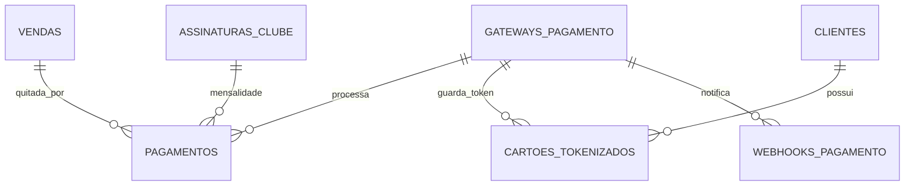

# Nextgest — Modelo de Dados: Pagamentos

> Documento vivo. Liga-se a [[Modelo de Dados - Produtos e Vendas]] e
> [[Modelo de Dados - Clube de Assinatura]]. Decisões em
> [[Decisões de Arquitetura]] (D19 a D21).

---

## 1. Princípios de segurança (leia antes de tudo)

- **Nunca** armazenar número de cartão, CVV ou validade em texto. O cartão é
  tokenizado pelo gateway; guardamos apenas o **token** que ele devolve.
- **Credenciais do gateway** (chaves de API de cada estabelecimento) ficam
  **criptografadas** no banco (cast `encrypted` do Laravel), nunca em texto puro,
  nunca em log, nunca em nota.
- Confiar no **webhook** do gateway para confirmar pagamento (Pix/boleto são
  assíncronos): o status só vira "aprovado" quando o gateway confirma.

---

## 2. Decisões deste bloco

- **Arquitetura plugável (adapter):** uma interface comum `GatewayPagamento`
  (cobrar, estornar, criar assinatura recorrente, ler webhook) e uma
  implementação por provedor. Primeiro provedor: **Mercado Pago**.
- **Métodos:** online (Pix e cartão via gateway) e presencial (dinheiro,
  maquininha) registrado manualmente.

---

## 3. Conceitos novos (glossário rápido)

- **Gateway:** o serviço externo que processa o pagamento (Mercado Pago, Asaas…).
- **Token de cartão:** referência que o gateway devolve no lugar do cartão real;
  permite cobrar sem nunca ter o número do cartão.
- **Webhook:** uma notificação que o gateway envia ao nosso sistema quando algo
  acontece (pagamento aprovado, estornado). Como Pix/boleto não confirmam na
  hora, é o webhook que diz "agora sim, foi pago".
- **Sandbox x Produção:** ambiente de teste (dinheiro falso) x ambiente real.
- **Recorrência:** cobrança automática que se repete (a mensalidade do clube).

---

## 4. Entidades (tabelas)

### 4.1 `gateways_pagamento` — configuração por estabelecimento

| Campo | Tipo | Para que serve |
|---|---|---|
| id | bigint PK | — |
| provedor | string/enum | mercadopago, asaas, ... |
| apelido | string null | Nome amigável |
| credenciais | text **encrypted** | Chaves de API (JSON criptografado) |
| modo | string/enum | sandbox, producao |
| ativo | boolean | Se está em uso |
| padrao | boolean | Gateway padrão do estabelecimento |
| timestamps | datetime | — |

> O conteúdo de `credenciais` é algo como `{ "access_token": "[chave secreta]" }`
> e é **gravado criptografado**. Nunca documentar a chave real.

### 4.2 `pagamentos`

| Campo | Tipo | Para que serve |
|---|---|---|
| id | bigint PK | — |
| venda_id | FK → vendas null | Se paga uma venda |
| assinatura_id | FK → assinaturas_clube null | Se é mensalidade do clube |
| gateway_id | FK → gateways_pagamento null | Null se for presencial |
| metodo | string/enum | pix, cartao_credito, cartao_debito, dinheiro, maquininha |
| valor | decimal(10,2) | Valor pago |
| status | string/enum | pendente, aprovado, recusado, estornado, cancelado |
| gateway_transacao_id | string null | ID da transação no gateway |
| pix_copia_cola | text null | Código Pix (quando aplicável) |
| link_pagamento | string null | Link/checkout do gateway |
| pago_em | datetime null | Quando foi confirmado |
| criado_por_user_id | FK → users null | Quem registrou (pagamento presencial) |
| observacao | string null | Notas |
| timestamps | datetime | — |

### 4.3 `cartoes_tokenizados` — cartões salvos (só token) **(recomendado)**

Para recorrência do clube e pagamento com 1 clique. **Sem dados do cartão real.**

| Campo | Tipo | Para que serve |
|---|---|---|
| id | bigint PK | — |
| cliente_id | FK → clientes | Dono do cartão |
| gateway_id | FK → gateways_pagamento | Em qual gateway o token vale |
| token | string | Token do cartão (do gateway) |
| bandeira | string null | Visa, Master... (só exibição) |
| ultimos4 | string null | Últimos 4 dígitos (só exibição) |
| validade_mes | tinyint null | Mês de validade (só exibição) |
| validade_ano | smallint null | Ano de validade (só exibição) |
| padrao | boolean | Cartão padrão |
| timestamps | datetime | — |

### 4.4 `webhooks_pagamento` — registro de notificações do gateway **(recomendado)**

| Campo | Tipo | Para que serve |
|---|---|---|
| id | bigint PK | — |
| gateway_id | FK → gateways_pagamento null | De qual gateway |
| evento | string | Tipo do evento |
| payload | json | Conteúdo recebido (auditoria) |
| processado | boolean | Se já foi tratado |
| recebido_em | datetime | Quando chegou |

---

## 5. Relacionamentos (resumo)

- `gateways_pagamento` 1 : N `pagamentos`.
- `vendas` 1 : N `pagamentos` (permite pagamento dividido).
- `assinaturas_clube` 1 : N `pagamentos` (cada mensalidade é um pagamento).
- `clientes` 1 : N `cartoes_tokenizados`.
- `gateways_pagamento` 1 : N `cartoes_tokenizados` e 1 : N `webhooks_pagamento`.

---

## 6. Diagrama (Mermaid)

---

## 7. Lógica importante (regras, não colunas)

- **Pagamento presencial:** `gateway_id` nulo, `status = aprovado` na hora,
  `criado_por_user_id` preenchido. Não chama gateway nenhum.
- **Pagamento online:** cria a cobrança no gateway, guarda
  `gateway_transacao_id` e fica `pendente` até o webhook confirmar.
- **Recorrência do clube:** a assinatura tem uma assinatura recorrente no gateway
  (ver colunas novas em `assinaturas_clube`). A cada ciclo o gateway cobra e
  manda webhook; geramos um `pagamento` ligado à `assinatura_id`.
- **Conciliação:** o webhook atualiza o `status` e o `pago_em`. A venda/assinatura
  só é considerada paga quando o pagamento está `aprovado`.

---

## 8. Impacto em outros blocos

`assinaturas_clube` ganha duas colunas:
- `gateway_id` (FK → gateways_pagamento null) — por onde a mensalidade é cobrada.
- `gateway_assinatura_id` (string null) — id da recorrência no gateway.

(Atualização registrada no documento de Clube de Assinatura.)

---

## 9. Pontos em aberto

1. **(A confirmar)** Pagamento dividido (parte Pix, parte dinheiro) já no MVP ou
   depois — o modelo já suporta (N pagamentos por venda).
2. **(A confirmar)** Estorno parcial e regras de reembolso.
3. **(A confirmar)** Recorrência via Mercado Pago: usar "preapproval"
   (assinatura nativa) ou cobrar mês a mês via job agendado.

---

## 10. Próximos blocos

1. Kanban.
2. Automações de WhatsApp (API oficial).
3. Dashboards e relatórios (consolidam tudo: agenda, vendas, comissão, clube,
   pagamentos).
