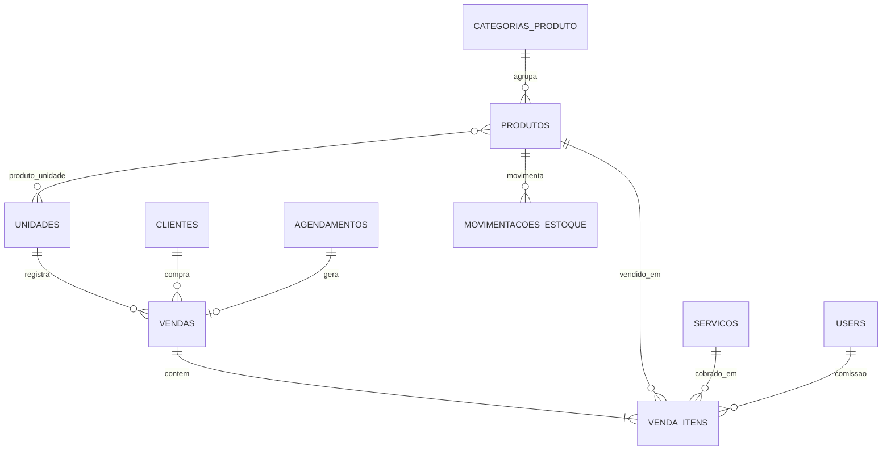

# Nextgest — Modelo de Dados: Produtos e Vendas

> Documento vivo. Continuação de [[Modelo de Dados - Núcleo de Agendamento]].
> Ver decisões em [[Decisões de Arquitetura]] (D12 a D14).

> [!check] Confirmado no código (Fatia 2A, 2026-06-21)
> As tabelas **3.1–3.4** (`categorias_produto`, `produtos`, `produto_unidade`,
> `movimentacoes_estoque`) existem exatamente como abaixo — `categorias_produto`/
> `produtos`/`produto_unidade` na migration **190003**; `movimentacoes_estoque` na
> **190004** (com `created_at` via `useCurrent`, sem `updated_at`). Detalhes
> confirmados: `produto_unidade` tem `unique(produto_id, unidade_id)` e **sem**
> timestamps; `movimentacoes_estoque.quantidade` é o **delta sinalizado** (+entra/
> −sai) e `venda_id` já tem FK para `vendas`. Models/UI/serviço implementados — ver
> [[Produtos e Estoque]].
> **A confirmar (entra na 2B):** `vendas`, `venda_itens`, `comissoes_profissional`
> (tabelas já existem no scaffold, mas sem models/UI ainda).

> [!check] Confirmado na Fatia 2B (2026-06-21)
> **3.5 `vendas`** e **3.6 `venda_itens`** confirmadas (migration **190004**, batem
> com o doc) — models `Venda`/`VendaItem` e serviço `App\Services\Venda\Comanda`
> implementados. Regras: snapshot de descrição/preço no item, `subtotal = preço × qtd`,
> `valor_total = bruto − desconto`, **baixa de estoque ao pagar** (com `venda_id`),
> **comissão básica snapshot** (produto via `percentual_comissao`; serviço sem comissão
> nesta fatia) e **estorno** ao cancelar venda paga. Ver [[Vendas e Comanda]].
> **A confirmar (2C):** **3.7 `comissoes_profissional`** (override por profissional) e
> a % padrão de serviço; desconto por item.

> [!check] Confirmado na Fatia 2C (2026-06-22)
> **3.7 `comissoes_profissional`** confirmada (190003) — model `ComissaoProfissional`
> (override por `user×serviço`/`user×produto`). Adicionada **`servicos.percentual_comissao`**
> (migration aditiva, espelha `produtos.percentual_comissao`). Precedência da comissão:
> override → % padrão (produto/serviço) → nenhuma, gravada como snapshot no item ao
> pagar. Relatório por profissional em `painel.comissoes`. Ver [[Comissões]].
> **Ainda pendente:** **desconto por item** (hoje só no total da venda — `venda_itens`
> não tem coluna de desconto).

---

## 1. Decisões deste bloco

- **Estoque:** opcional por produto (cada produto marca se controla estoque) e a
  quantidade é **por unidade** (cada filial tem seu estoque).
- **Venda/comanda unificada:** uma venda pode conter **produtos e serviços** e
  pode estar **ligada a um agendamento** (atendimento) ou ser **avulsa** (balcão).
- **Comissão por profissional:** cada item da venda pode atribuir comissão ao
  profissional que executou o serviço ou vendeu o produto.

---

## 2. Conceitos novos (glossário rápido)

- **Comanda / Venda:** o registro do que foi consumido/comprado num atendimento
  ou no balcão. É o "guarda-chuva" que junta os itens e fecha num total. Alimenta
  o faturamento, o ticket médio e os relatórios.
- **Comissão:** parte do valor de um serviço ou produto que vai para o
  profissional. Guardamos o **valor calculado** no item da venda (snapshot), para
  o histórico não mudar se a % mudar depois.
- **Movimentação de estoque:** cada entrada (compra/reposição) ou saída (venda)
  vira um registro. Assim o estoque atual é sempre rastreável (de onde veio,
  para onde foi) — importante para o controle de gastos.

---

## 3. Entidades (tabelas)

### 3.1 `categorias_produto` — organização dos produtos (opcional)

| Campo | Tipo | Para que serve |
|---|---|---|
| id | bigint PK | — |
| nome | string | Ex.: "Pomadas", "Bebidas" |
| ativo | boolean | — |
| timestamps | datetime | — |

### 3.2 `produtos`

| Campo | Tipo | Para que serve |
|---|---|---|
| id | bigint PK | — |
| categoria_id | FK → categorias_produto null | Categoria |
| nome | string | Nome do produto |
| descricao | text null | Detalhes |
| sku | string null | Código interno / código de barras |
| preco_venda | decimal(10,2) | Preço de venda |
| preco_custo | decimal(10,2) null | Custo (para calcular lucro) |
| controla_estoque | boolean | Se dá baixa de estoque ao vender |
| percentual_comissao | decimal(5,2) null | Comissão padrão deste produto (%) |
| ativo | boolean | — |
| timestamps | datetime | — |

### 3.3 `produto_unidade` — estoque por filial (pivô com dado)

| Campo | Tipo | Para que serve |
|---|---|---|
| id | bigint PK | — |
| produto_id | FK → produtos | Qual produto |
| unidade_id | FK → unidades | Qual filial |
| quantidade | integer | Estoque atual nessa filial |

Só faz sentido quando `produtos.controla_estoque = true`.

### 3.4 `movimentacoes_estoque` — histórico de entradas e saídas (recomendado)

| Campo | Tipo | Para que serve |
|---|---|---|
| id | bigint PK | — |
| produto_id | FK → produtos | — |
| unidade_id | FK → unidades | Em qual filial |
| tipo | string/enum | entrada, saida, ajuste |
| quantidade | integer | Quanto entrou/saiu |
| motivo | string null | Ex.: "Venda", "Reposição", "Perda" |
| venda_id | FK → vendas null | Se a saída veio de uma venda |
| user_id | FK → users null | Quem registrou |
| created_at | datetime | Quando |

### 3.5 `vendas` — a comanda

| Campo | Tipo | Para que serve |
|---|---|---|
| id | bigint PK | — |
| unidade_id | FK → unidades | Onde foi a venda |
| cliente_id | FK → clientes null | Cliente (pode ser venda anônima de balcão) |
| agendamento_id | FK → agendamentos null | Se nasceu de um atendimento |
| status | string/enum | aberta, paga, cancelada |
| valor_bruto | decimal(10,2) | Soma dos itens |
| desconto | decimal(10,2) | Desconto aplicado no total |
| valor_total | decimal(10,2) | valor_bruto − desconto |
| criado_por_user_id | FK → users null | Quem abriu a venda |
| data | datetime | Data/hora da venda |
| timestamps | datetime | — |

### 3.6 `venda_itens` — os itens da comanda

Um item é **ou** um serviço **ou** um produto (por isso os dois FKs são opcionais,
mas exatamente um é preenchido).

| Campo | Tipo | Para que serve |
|---|---|---|
| id | bigint PK | — |
| venda_id | FK → vendas | Comanda pai |
| tipo | string/enum | servico, produto |
| servico_id | FK → servicos null | Se for serviço |
| produto_id | FK → produtos null | Se for produto |
| descricao | string | **Snapshot** do nome no momento |
| quantidade | integer | Quantidade (produtos; serviço normalmente 1) |
| preco_unitario | decimal(10,2) | **Snapshot** do preço |
| subtotal | decimal(10,2) | preco_unitario × quantidade |
| profissional_id | FK → users null | Quem executou/vendeu (para comissão) |
| percentual_comissao | decimal(5,2) null | **Snapshot** da % aplicada |
| valor_comissao | decimal(10,2) null | **Snapshot** do valor da comissão |
| coberto_por_assinatura | boolean | Item incluído no plano do clube (preço 0) |
| assinatura_id | FK → assinaturas_clube null | Assinatura que cobriu/descontou |
| timestamps | datetime | — |

### 3.7 `comissoes_profissional` — exceções de comissão

Override opcional: quando um profissional específico tem % diferente do padrão.

| Campo | Tipo | Para que serve |
|---|---|---|
| id | bigint PK | — |
| user_id | FK → users | Profissional |
| servico_id | FK → servicos null | Override para um serviço |
| produto_id | FK → produtos null | Override para um produto |
| percentual | decimal(5,2) | % específica |

A regra de cálculo: usa o override do profissional se existir; senão, a % do
serviço/produto; senão, sem comissão.

---

## 4. Relacionamentos (resumo)

- `unidades` 1 : N `vendas`.
- `clientes` 1 : N `vendas` (cliente opcional — venda de balcão pode ser anônima).
- `agendamentos` 0..1 : 1 `vendas` — uma venda pode vir de um agendamento.
- `vendas` 1 : N `venda_itens`.
- `produtos` 1 : N `venda_itens` / `servicos` 1 : N `venda_itens`.
- `produtos` N : N `unidades` (via `produto_unidade`) — estoque por filial.
- `produtos` 1 : N `movimentacoes_estoque`.
- `users` (profissional) 1 : N `venda_itens` — para comissão.
- `categorias_produto` 1 : N `produtos`.

---

## 5. Diagrama (Mermaid)

---

## 6. Lógica importante (regras, não colunas)

- **Origem dos itens:** quando a venda nasce de um agendamento, os serviços do
  `agendamento_servico` são copiados para `venda_itens` (com snapshot). A agenda
  guarda o atendimento; a venda guarda o financeiro. São papéis diferentes.
- **Baixa de estoque:** ao pagar uma venda, cada item de produto com
  `controla_estoque = true` gera uma `movimentacao_estoque` de saída e reduz o
  `produto_unidade.quantidade` da filial.
- **Cálculo da comissão:** no momento da venda, define a % (override do
  profissional → padrão do item → nenhuma) e grava `valor_comissao` como snapshot.
- **Lucro:** `preco_venda − preco_custo` por produto alimenta os gráficos de
  lucratividade. Por isso `preco_custo` é importante mesmo sendo opcional.

---

## 7. Pontos em aberto

1. **Confirmado:** override de comissão por profissional (`comissoes_profissional`)
   entra agora.
2. **Confirmado:** desconto somente no total da venda (sem desconto por item).
3. **Pagamento** (forma de pagamento, gateway, status) será o próximo bloco e se
   liga à `vendas`.

---

## 8. Próximos blocos

1. Clube de assinatura (planos, assinatura do cliente, cota/uso mensal).
2. Pagamentos (gateway plugável, tokenização — nunca guardar dados de cartão).
3. Kanban.
4. Automações de WhatsApp.
